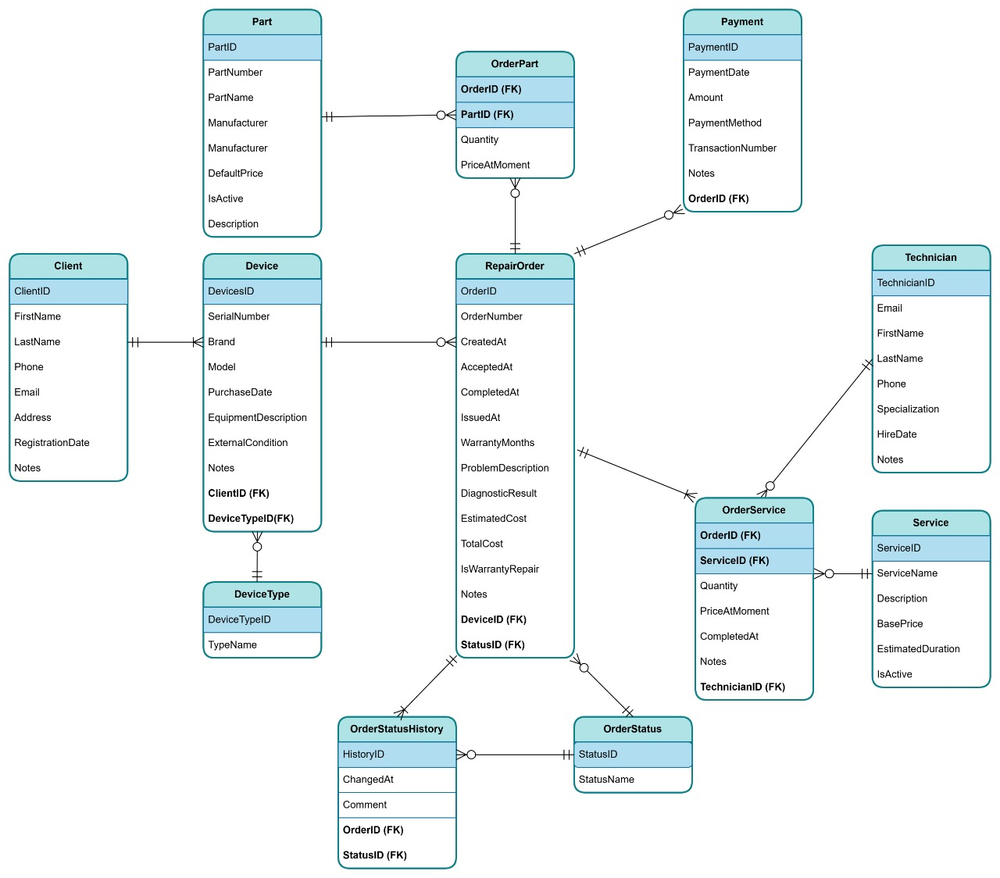

# TechRepair CRM

**TechRepair CRM** — учебный проект CRM-системы для сервисного центра по ремонту техники.

Система предназначена для учёта клиентов, устройств, заказов на ремонт, выполняемых услуг, используемых запчастей, оплат и истории изменения статусов заказов.

---

## Основные возможности проекта

- учёт клиентов сервисного центра;
- хранение информации об устройствах клиентов;
- создание и сопровождение заказов на ремонт;
- назначение услуг и запчастей к заказам;
- учёт мастеров и выполняемых работ;
- хранение истории изменения статусов заказа;
- контроль оплат по заказам;
- использование бизнес-логики на стороне базы данных через функции и триггеры;
- REST API для работы с данными;
- Swagger UI для тестирования API.

---

## Технологии

- **C#**
- **ASP.NET Core Web API**
- **.NET 9**
- **Entity Framework Core**
- **PostgreSQL**
- **Npgsql**
- **Swagger / Swashbuckle**
- **Rider**
- **pgAdmin**

---

## ER-диаграмма базы данных

ER-диаграмма отражает основные сущности системы и связи между ними: клиентов, устройства, заказы на ремонт, услуги, запчасти, оплаты, мастеров и историю статусов заказа.



---

## База данных

В проекте используется PostgreSQL.

Основные таблицы базы данных:

- `client` — клиенты сервисного центра;
- `device_type` — типы устройств;
- `device` — устройства клиентов;
- `repair_order` — заказы на ремонт;
- `order_status` — справочник статусов заказов;
- `order_status_history` — история изменения статусов заказов;
- `technician` — мастера сервисного центра;
- `service` — справочник ремонтных услуг;
- `part` — справочник запчастей;
- `order_service` — услуги, добавленные в заказ;
- `order_part` — запчасти, использованные в заказе;
- `payment` — оплаты по заказам.


---
## Запуск проекта

1. Клонировать репозиторий:

```bash
git clone https://github.com/Gurov-Vyacheslav/TechRepair-CRM.git
```

2. Перейти в папку проекта:

```bash
cd TechRepair-CRM
```

3. Восстановить зависимости:

```bash
dotnet restore
```

4. Указать строку подключения к PostgreSQL в `appsettings.Development.json`.

5. Запустить проект:

```bash
dotnet run
```

6. Открыть Swagger UI:

```text
http://localhost:5235/
```

---

## API

Для тестирования API используется Swagger UI.

В проекте реализуется REST API для работы с основными сущностями системы:

- клиенты;
- устройства;
- заказы на ремонт;
- мастера;
- услуги;
- запчасти;
- оплаты;
- статусы заказов.

---

## Цель проекта

Цель проекта — разработать серверную часть CRM-системы для сервисного центра, которая позволяет автоматизировать основные процессы учёта ремонтных заказов и продемонстрировать навыки проектирования базы данных, реализации бизнес-логики и разработки Web API на ASP.NET Core.

---

## Автор

Гуров Вячеслав  
.NET Developer